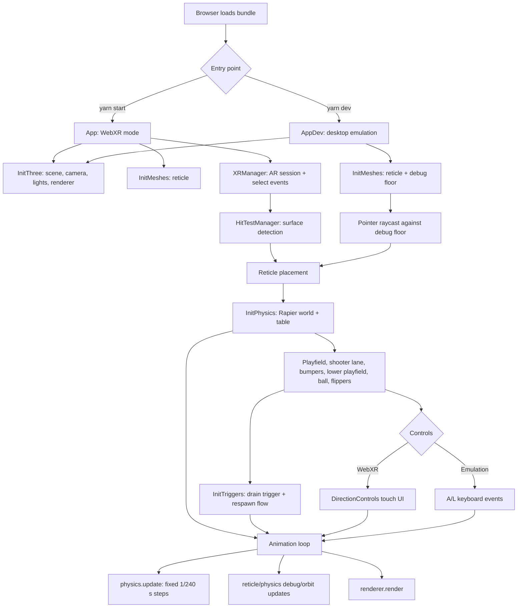

# pinball-xr
## A three.js and Rapier webxr pinball web app.

Real-world pinball differs from a video game in that the player is continuously moving their gaze over a physical playfield (like a spectator watching a tennis game).

Given the current strengths and weaknesses of mobile-based AR, standing in front of a virtual pinball machine could be a compelling mixed-reality experience.

### Approach
This project will be in three phases:
1. A [Rapier](https://rapier.rs/) wireframe that establishes the physics of gameplay.
2. ARCore implementation. 
3. A Three.js 'skin' on top of the Rapier physics bodies (plus sound design).

### Tools
I am initially developing in vanilla Javascript - along with [Rapier](https://rapier.rs/) - with an eye on refactoring to incorporate [react-three-fiber](https://github.com/pmndrs/react-three-fiber) and [zustand](https://github.com/pmndrs/zustand).


### Progress
I am establishing a baseline for the pinball game's physics behavior in WebXR. The physics now runs on Rapier (it was previously cannon-es), and the table is currently drawn as the Rapier debug wireframe until the visual and audio theming phase. In addition to the WebXR mode, there is a desktop browser 'emulation' mode that enables faster iteration when developing non-WebXR functionality.

## Application Architecture

The application has two entry points that share the same pinball table logic:

- `yarn start` uses `src/index.js` and `src/app.js` for the WebXR flow.
- `yarn dev` uses `src/index.dev.js` and `src/AppDev.js` for desktop emulation.

Webpack selects the entry point from the `development` environment flag. Both entry points initialize Three.js rendering and temporary placement meshes, then build the same Rapier physics world once a placement is chosen. The difference is how the table placement is chosen: WebXR uses AR hit testing and a screen tap, while emulation uses a raycast from the pointer onto a debug floor.



### Logic Flow

1. `InitThree` creates the Three.js scene wrapper, camera, lights, renderer, and optional orbit controls for debug mode.
2. `InitMeshes` creates placement helpers. WebXR uses the animated reticle with WebXR hit-test matrices; emulation uses the same reticle positioned by a pointer raycast against `DebugFloorMesh`.
3. Once the user chooses a placement, `InitPhysics` loads Rapier and builds the table at that world position. All static colliders hang off one fixed table body tilted to the playfield slope; the ball is a dynamic body with continuous collision detection, and each flipper is a dynamic body on a revolute joint.
4. `InitTriggers` adds the drain sensor across the bottom of the table. When the ball enters it, the ball is disabled, the shooter lane opens, the ball respawns, and the lane closes again after a delay.
5. Input is connected after the physics bodies exist. WebXR mode creates touch controls that call the flipper `onFlipperUp` and `onFlipperDown` handlers. Emulation mode binds the `A` and `L` keys to the same handlers.
6. The animation loop calls `physics.update(dt)`, which advances the world in fixed 1/240 s steps (applying rolling resistance and flipper coil torque, then dispatching collision events each step), so behaviour is identical at 60 Hz on desktop and 72-120 Hz in a headset. It then runs per-frame updates such as debug rendering and renders the Three.js scene.

### Component Responsibilities

- `src/three/` owns rendering setup: scene, camera, lights, WebGL renderer, and debug renderer.
- `src/webXR/` owns AR session lifecycle and hit testing.
- `src/meshes/` owns Three.js-only placement visuals, currently the reticle and debug floor.
- `src/physics/` owns gameplay physics, including the fixed-step loop, table frame, bodies, shape helpers, materials, collision groups, and triggers. Tuning values live in `PHYSICS.config.js`, `MATERIALS.js`, and the `*.config.js` files beside each body.
- `src/debug/` owns debugging helpers such as keyboard input, the floor mesh, the Rapier wireframe renderer, the FPS / physics-time overlay, and orbit controls.
- `src/ui/` owns DOM controls used during the WebXR session.
- `src/App.config.js` centralizes gameplay constants such as gravity, camera position, ball settings, playfield slope, the table's height above the detected floor, and the `DEBUG.showPhysics` wireframe toggle.

### Physics Model

- **Fixed timestep.** The simulation always advances in 1/240 s steps, however fast the display refreshes. At 1/60 s a 4 m/s ball would move more than twice its own diameter per step.
- **Table frame.** Layout is written in table space (x across, y up from the playfield, z toward the player). One fixed body carries the playfield slope, and every static collider is attached to it with local offsets.
- **Primitive colliders.** Walls, floor, and glass are boxes. The curved orbit is built from box segments (`shapes/arcSegments.js`), and lane guides and slingshots from straight segments along a path (`shapes/polylineSegments.js`). Outer walls are thicker than the ball, and the floor has real thickness.
- **Ball.** A dynamic sphere with continuous collision detection (CCD), so fast shots cannot tunnel through walls. Rolling resistance slows it slightly while it is on the playfield, which Rapier does not model on its own; without it a cradled ball rocks indefinitely.
- **Flippers.** About 3" (76 mm) long, like a real flipper. Each is a dynamic body on a revolute joint whose limits are the rest and up stops, driven by a solenoid model each physics step: full coil torque on the up stroke, weaker hold torque near the up stop (like a real end-of-stroke switch), and a return spring. Because the flipper has mass and finite torque, a hard shot can push a raised flipper back, and the ball slows the flipper as it is struck.
- **Materials.** The ball uses coefficients of 1 with the `Min` combine rule, so each contact takes the friction and restitution of the surface it touches (`MATERIALS.js`).
- **Lower playfield.** Inlane/outlane dividers end flush with each flipper's top face so the inlane feeds the ball onto the flipper, and outlanes run down the side walls to the drain. Rubber deflectors on the side walls stop a ball running down a wall, such as the plunge coming off the orbit, from dropping straight into an outlane. The layout is derived from the flipper geometry (`LowerPlayfield.config.js`), so moving or resizing the flippers keeps the guides flush.
- **Events.** Only the ball enables collision events. Bumpers and slingshots register kick handlers that send the ball away at a minimum speed. Slingshots fire only when the ball moves into the face above a threshold speed, and each kick varies slightly, as on a real table, so the ball cannot settle into an endless bounce loop. The drain sensor spans the bottom of the table.

Common tuning values:

| Setting | File |
|---|---|
| Timestep, solver iterations, `lengthUnit` | `src/physics/PHYSICS.config.js` |
| Friction and restitution per surface | `src/physics/MATERIALS.js` |
| Flipper shape, position, angles, mass, and coil / hold / return torques | `src/physics/bodies/Flipper.config.js` |
| Inlane and outlane widths, slingshot shape, kick speed and variation, outlane deflectors | `src/physics/bodies/LowerPlayfield.config.js` |
| Bumper size, positions, and kick speed | `src/physics/bodies/Bumper.config.js` |
| Ball mass, radius, and launch speed | `src/App.config.js` |
| Rolling resistance | `src/physics/bodies/Ball.config.js` |


## Running Locally

Make sure you have [Node.js](http://nodejs.org/) installed.

```sh
git clone https://github.com/patrick-s-young/pinball-xr.git # or clone your own fork
cd pinball-xr
yarn (to install)
yarn start (for WebXR mode)
yarn dev (for AR emulation mode)
```
The equivalent `npm install`, `npm start`, and `npm run dev` commands also work.

- Click the debug floor to place the table.
- Left Flipper: A Key
- Right Flipper: L Key
- Refresh browser for new ball (or let ball fall down drain).
- In emulation mode, the overlay in the top-left shows FPS; click it to cycle to frame time, memory, and physics time per frame.

## Built With

* [Rapier](https://rapier.rs/) ([@dimforge/rapier3d-compat](https://www.npmjs.com/package/@dimforge/rapier3d-compat)) - rigid body physics engine (WASM).
* [three.js](https://www.npmjs.com/package/three) - lightweight, cross-browser, general purpose 3D library.
* [stats.js](https://www.npmjs.com/package/stats.js) - FPS and physics-time overlay in emulation mode.
* [webpack](https://webpack.js.org/) - static module builder.

## Authors

* **Patrick Young** - [Patrick Young](https://github.com/patrick-s-young)

## License

This project is licensed under the MIT License - see the [LICENSE](LICENSE) file for details.
