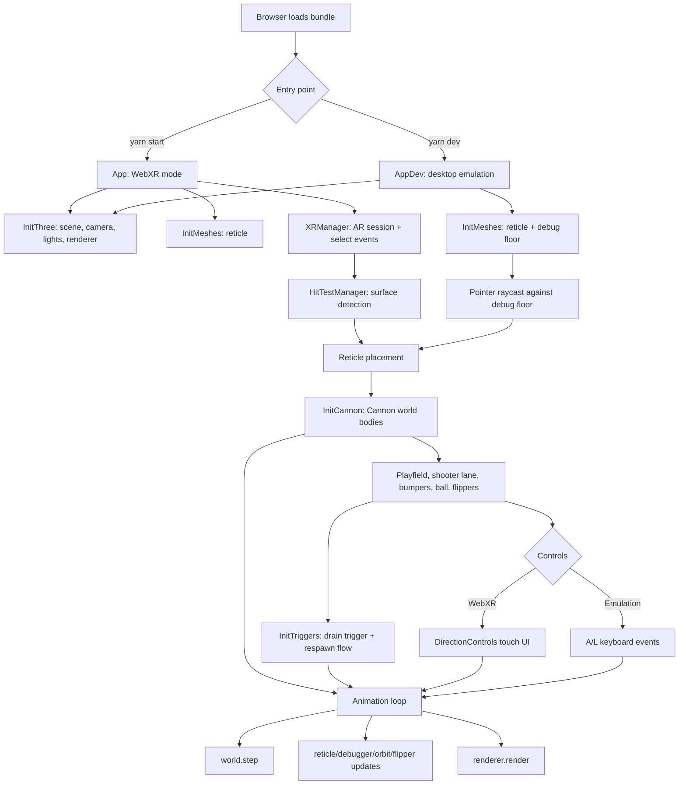

# pinball-xr
## A three.js and cannon-es webxr pinball web app.

Real-world pinball differs from a video game in that the player is continuously moving their gaze over a physical playfield (like a spectator watching a tennis game).

Given the current strengths and weaknesses of mobile-based AR, standing in front of a virtual pinball machine could be a compelling mixed-reality experience.

### Approach
This project will be in three phases:
1. A [cannon-es](https://github.com/pmndrs/cannon-es) wireframe that establishes the physics of gameplay.
2. ARCore implementation. 
3. A Three.js 'skin' on top of the cannon-es physics bodies (plus sound design).

### Tools
I am initially developing in vanilla Javascript - along with [cannon-es](https://github.com/pmndrs/cannon-es) - with an eye on refactoring to incorporate [react-three-fiber](https://github.com/pmndrs/react-three-fiber) and [zustand](https://github.com/pmndrs/zustand).


### Progress
I am establishing a baseline for the pinball game's physics behavior in WebXR. The videos below depict cannon-es in debugger mode. In addition to the WebXR mode, there is a desktop browser 'emulation' mode that enables faster iteration when developing non-WebXR functionality.

WebXR mode 'yarn start'

https://github.com/patrick-s-young/pinball-xr/assets/42591798/183ca26b-f026-4679-96cc-62b63bbda7bf

Emulation mode 'yarn dev'

https://github.com/patrick-s-young/pinball-xr/assets/42591798/b6b28d8c-4b32-42d3-8488-d6a1503cda5b

## Application Architecture

The application has two entry points that share the same pinball table logic:

- `yarn start` uses `src/index.js` and `src/app.js` for the WebXR flow.
- `yarn dev` uses `src/index.dev.js` and `src/AppDev.js` for desktop emulation.

Webpack selects the entry point from the `development` environment flag. Both entry points initialize Three.js rendering, temporary placement meshes, and a Cannon world. The difference is how the table placement is chosen: WebXR uses AR hit testing and a screen tap, while emulation uses a raycast from the pointer onto a debug floor.



### Logic Flow

1. `InitThree` creates the Three.js scene wrapper, camera, lights, renderer, and optional orbit controls for debug mode.
2. `InitMeshes` creates placement helpers. WebXR uses the animated reticle with WebXR hit-test matrices; emulation uses the same reticle positioned by a pointer raycast against `DebugFloorMesh`.
3. Once the user chooses a placement, `InitCannon` builds the physics table at that world position. It configures gravity and contact materials, then creates the playfield, shooter lane, bumpers, ball, left flipper, and right flipper.
4. `InitTriggers` adds the drain trigger. When the ball collides with it, the shooter lane opens, the ball respawns, and the lane closes again after a delay.
5. Input is connected after the physics bodies exist. WebXR mode creates touch controls that call the flipper `onFlipperUp` and `onFlipperDown` handlers. Emulation mode binds the `A` and `L` keys to the same handlers.
6. The animation loop advances the Cannon world, runs registered per-frame updates such as flipper animation and debug rendering, and then renders the Three.js scene.

### Component Responsibilities

- `src/three/` owns rendering setup: scene, camera, lights, WebGL renderer, and debug renderer.
- `src/webXR/` owns AR session lifecycle and hit testing.
- `src/meshes/` owns Three.js-only placement visuals, currently the reticle and debug floor.
- `src/cannon/` owns gameplay physics, including bodies, shapes, materials, collision groups, and triggers.
- `src/debug/` owns desktop-only debugging helpers such as keyboard input, the floor mesh, Cannon debugger wiring, and orbit controls.
- `src/ui/` owns DOM controls used during the WebXR session.
- `src/App.config.js` centralizes gameplay constants such as gravity, camera position, ball settings, playfield slope, and the table's height above the detected floor.


## Running Locally

Make sure you have [Node.js](http://nodejs.org/) installed.

```sh
git clone https://github.com/patrick-s-young/pinball-xr.git # or clone your own fork
cd pinball-xr
yarn (to install)
yarn start (for WebXR mode)
yarn dev (for AR emulation mode)
```
- Left Flipper: A Key
- Right Fipper: L Key
- Refresh browser for new ball (or let ball fall down drain).

## Built With

* [cannon-es](https://www.npmjs.com/package/cannon-es) - rigid body physics engine.
* [three.js](https://www.npmjs.com/package/three) - lightweight, cross-browser, general purpose 3D library.
* [cannon-es-debugger](https://www.npmjs.com/package/cannon-es-debugger) - debugger for use with cannon-es.
* [stats.js](https://www.npmjs.com/package/stats-js) - JavaScript performance monitor.
* [webpack](https://webpack.js.org/) - static module builder.

## Authors

* **Patrick Young** - [Patrick Young](https://github.com/patrick-s-young)

## License

This project is licensed under the MIT License - see the [LICENSE](LICENSE) file for details.
