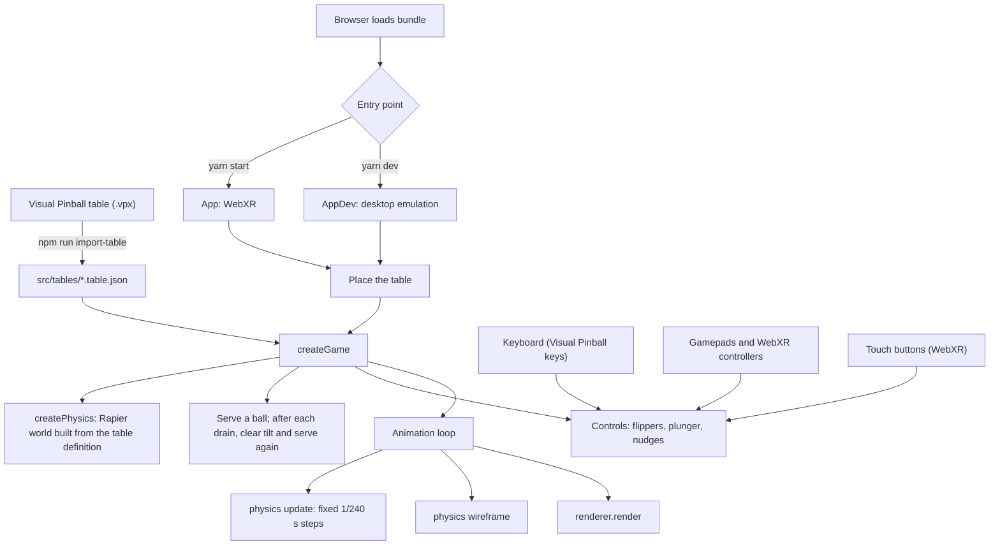

# pinball-xr
## A three.js and Rapier webxr pinball web app.

Real-world pinball differs from a video game in that the player is continuously moving their gaze over a physical playfield (like a spectator watching a tennis game).

Given the current strengths and weaknesses of mobile-based AR, standing in front of a virtual pinball machine could be a compelling mixed-reality experience.

### Approach
This project will be in three phases:
1. A [Rapier](https://rapier.rs/) wireframe that establishes the physics of gameplay.
2. ARCore implementation. 
3. A Three.js 'skin' on top of the Rapier physics bodies (plus sound design).

### Tools
I am initially developing in vanilla Javascript - along with [Rapier](https://rapier.rs/) - with an eye on refactoring to incorporate [react-three-fiber](https://github.com/pmndrs/react-three-fiber) and [zustand](https://github.com/pmndrs/zustand).


### Progress
I am establishing a baseline for the pinball game's physics behavior in WebXR. Tables are designed in [Visual Pinball X](https://github.com/vpinball/vpinball) and imported, and the physics runs on Rapier. The table is currently drawn as the Rapier debug wireframe until the visual and audio theming phase. In addition to the WebXR mode, there is a desktop browser 'emulation' mode that enables faster iteration when developing non-WebXR functionality.

## Application Architecture

The application has two entry points that share the same game:

- `yarn start` uses `src/index.js` and `src/App.js` for the WebXR flow.
- `yarn dev` uses `src/index.dev.js` and `src/AppDev.js` for desktop emulation.

Webpack selects the entry point from the `development` environment flag. Both apps place the table (WebXR by AR hit testing and a screen tap, emulation by a raycast from the pointer onto a debug floor), then start the same game and connect their own input devices to it.



### Component Responsibilities

- `src/tables/` holds the imported table definitions and chooses which to load.
- `src/game/Game.js` runs one game on one table: builds the physics, serves balls, shows tilt messages, and draws the physics wireframe.
- `src/physics/` is the physics. `createPhysics.js` builds the Rapier world from a table definition; `elements/` has one module per kind of table element (walls, slingshots, gates, drains, flippers, plunger, ball, playfield); `Nudge.js` handles nudging and tilt. Every tuning value is in `TUNING.js`.
- `src/input/` has `Controls.js`, the actions every device drives, plus the keyboard and gamepad / WebXR controller inputs.
- `src/ui/` has the WebXR touch buttons, the AR button, and the status message for tilt warnings.
- `src/three/`, `src/webXR/`, `src/meshes/` set up rendering, the AR session and hit testing, and the placement reticle.
- `src/debug/` has the emulation-mode renderer, the physics wireframe, the debug floor, and the FPS / physics-time overlay.
- `tools/vpx-import.js` converts Visual Pinball tables; `test/physics/` checks the physics of every imported table.

### Physics Model

- **Fixed timestep.** The simulation always advances in 1/240 s steps, however fast the display refreshes. At 1/60 s a 4 m/s ball would move more than twice its own diameter per step.
- **Table frame.** Everything is in table space: x across, y up from the playfield, z toward the player, origin at the playfield centre. One body carries the playfield slope and every static collider. It is kinematic so a nudge can move the whole cabinet.
- **Walls and rubbers.** Each is a single triangle mesh built from its Visual Pinball outline: vertical faces from the playfield to its top, and a top. Visual Pinball's curves are reproduced exactly, and the importer samples them only as finely as each curve needs. Walls are at least as tall as the ball, as Visual Pinball treats them.
- **Ball.** A dynamic sphere with continuous collision detection (CCD), so fast shots cannot tunnel through walls. Rolling resistance slows it slightly while it is on the playfield, which Rapier does not model on its own; without it a cradled ball rocks indefinitely.
- **Flippers.** Each is a dynamic body on a revolute joint whose limits are the rest and up stops, driven by a solenoid model each physics step: full coil torque on the up stroke, weaker end-of-stroke torque near the up stop, and a return spring. Visual Pinball's strength, mass, return strength, and end-of-stroke settings scale the runtime's values. Because the flipper has mass and finite torque, a hard shot can push a raised flipper back, and the ball slows the flipper as it is struck.
- **Materials.** The ball uses coefficients of 1 with the `Min` combine rule, so each contact takes the friction and elasticity Visual Pinball gives the surface it touches.
- **Slingshots.** A sensor in front of each kicking face. They fire only when the ball moves into the face above a threshold speed, with strength scaled by Visual Pinball's slingshot force, and each kick varies slightly, as on a real table, so the ball cannot settle into an endless bounce loop.
- **Gates.** A one-way gate is a thin wall that only acts on a ball already past it, decided per contact by a Rapier contact filter. A ball passes the allowed way at nearly full speed, as in Visual Pinball, and is stopped the other way.
- **Plunger.** A served ball waits at rest against the plunger tip. Holding the plunger builds pull over one second, and releasing launches the ball up the lane at 0.5-5.5 m/s depending on the pull; it only fires when the ball is resting at the plunger. A weak shot rolls back for another try.
- **Nudge.** A nudge shoves the whole cabinet 15 mm and lets it spring back over 0.1 s; the flippers move with it. As on a real table, the ball is affected only through contact: a nudge knocks a ball off a wall, post, or flipper it is touching, and does almost nothing to a ball rolling freely.
- **Tilt.** A plumb-bob model. Each nudge adds to the bob's swing, which dies away over time, and while the swing is high the bob strikes the tilt ring once per half swing. Two quick nudges give a warning, the first two strikes are warnings, and the third tilts the machine: flippers and slingshots lose power until the ball drains. The plunger still works, and the next ball starts with the tilt cleared.
- **Drain.** A sensor at each Visual Pinball kicker named `Drain`.

Tuning values are all in `src/physics/TUNING.js`: timestep and solver settings, ball mass and rolling resistance, how Visual Pinball's flipper, plunger, and slingshot settings map onto the runtime, and nudge and tilt sensitivity. Changing them never needs a re-import.

## Running Locally

Make sure you have [Node.js](http://nodejs.org/) installed.

```sh
git clone https://github.com/patrick-s-young/pinball-xr.git # or clone your own fork
cd pinball-xr
yarn (to install)
yarn start (for WebXR mode)
yarn dev (for AR emulation mode)
yarn test:physics (headless physics checks)
```
The equivalent `npm install`, `npm start`, `npm run dev`, and `npm run test:physics` commands also work.

In emulation mode, click the debug floor to place the table. Controls follow Visual Pinball's defaults:

| Action | Keyboard | Gamepad | WebXR controllers | WebXR touch |
|---|---|---|---|---|
| Left flipper | Left Shift | Left bumper or trigger | Left trigger | Left red button |
| Right flipper | Right Shift | Right bumper or trigger | Right trigger | Right red button |
| Plunger (hold to pull, release to launch) | Enter | A / cross | Right grip | Orange button |
| Nudge from the left / right / front | Z / `/` / Space | D-pad left / right / up | Left grip (front) | NUDGE L / NUDGE R / NUDGE |

- The longer you hold the plunger (up to one second), the harder the shot.
- Nudge too much and you get tilt warnings, then TILT.
- A new ball is served to the plunger a second after each drain (or refresh the browser).
- In emulation mode, the overlay in the top-left shows FPS; click it to cycle to frame time, memory, and physics time per frame.
- The table loaded is `DEFAULT_TABLE` in `src/App.config.js`. Add `?table=<name>` to the page URL to load another.

## Designing Tables in Visual Pinball

Tables are designed in [Visual Pinball X](https://github.com/vpinball/vpinball) and imported. The importer converts a `.vpx` file into a table definition the physics builds from; the app's own flippers, plunger, slingshot kicks, nudge, and tilt then run on that layout.

1. Download [vpxtool](https://github.com/francisdb/vpxtool/releases), which reads `.vpx` files, and set the `VPXTOOL` environment variable to its path (or put it on your `PATH`).
2. Save the table in `tables/`. `.vpx` files are kept out of git.
3. Run the importer. It writes `src/tables/<name>.table.json` and lists everything it skipped and why:
   ```sh
   VPXTOOL=/path/to/vpxtool npm run import-table -- tables/<name>.vpx
   ```
4. Add the new file to `TABLES` in `src/tables/index.js`, then load it with `?table=<name>`.
5. Run `npm run test:physics`. It checks every table for balls getting stuck, passing through walls, or failing to drain, and checks the flippers, plunger, gates, slingshots, and tilt.

What is imported:

| Visual Pinball | In pinball-xr |
|---|---|
| Playfield size, slope, glass height, friction, elasticity | Floor, glass, boundary walls, and table slope |
| Walls and rubbers at ball height, including smooth (curved) drag points | One triangle mesh each, using Visual Pinball's curve interpolation |
| Slingshot segments of walls | Slingshot kickers, scaled by the wall's slingshot force |
| Flippers | Position, length, radii, angles, strength, mass, return strength, and end-of-stroke torque |
| One-way gates | One-way walls in the gate's direction |
| Plunger | Serve position and strength |
| Kickers named `Drain` | Drain sensors |
| Triggers | Recorded for later scoring (no physics effect) |

Not imported yet: ramps, collidable 3D primitives, bumpers, spinners, targets, and anything visual (images, lights, decals). The table script (VBScript) does not run; game rules will be written in JavaScript.

## Built With

* [Rapier](https://rapier.rs/) ([@dimforge/rapier3d-compat](https://www.npmjs.com/package/@dimforge/rapier3d-compat)) - rigid body physics engine (WASM).
* [three.js](https://www.npmjs.com/package/three) - lightweight, cross-browser, general purpose 3D library.
* [vpxtool](https://github.com/francisdb/vpxtool) - reads Visual Pinball tables for the importer.
* [stats.js](https://www.npmjs.com/package/stats.js) - FPS and physics-time overlay in emulation mode.
* [webpack](https://webpack.js.org/) - static module builder.

## Authors

* **Patrick Young** - [Patrick Young](https://github.com/patrick-s-young)

## License

This project is licensed under the MIT License - see the [LICENSE](LICENSE) file for details.
